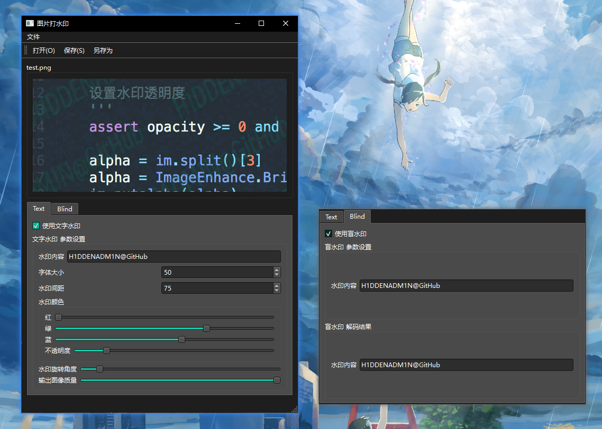

# 图片打水印

为图片添加水印，支持文字水印和盲水印。

- [文字水印](https://github.com/2Dou/watermarker)：可设置并实时预览 水印内容、字体大小、间距、颜色、透明度、角度、图片质量。
- [盲水印](https://github.com/guofei9987/blind_watermark)：可设置盲水印内容。可实时预览盲水印解码结果。



## Usage

```powershell
pip install -r requirements.txt

python .\watermarker.py
```
