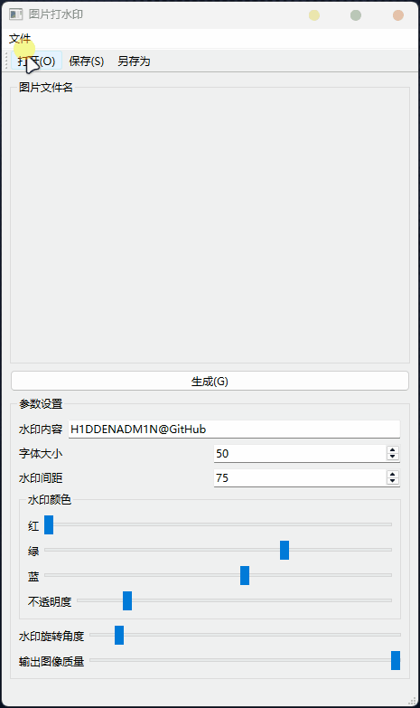
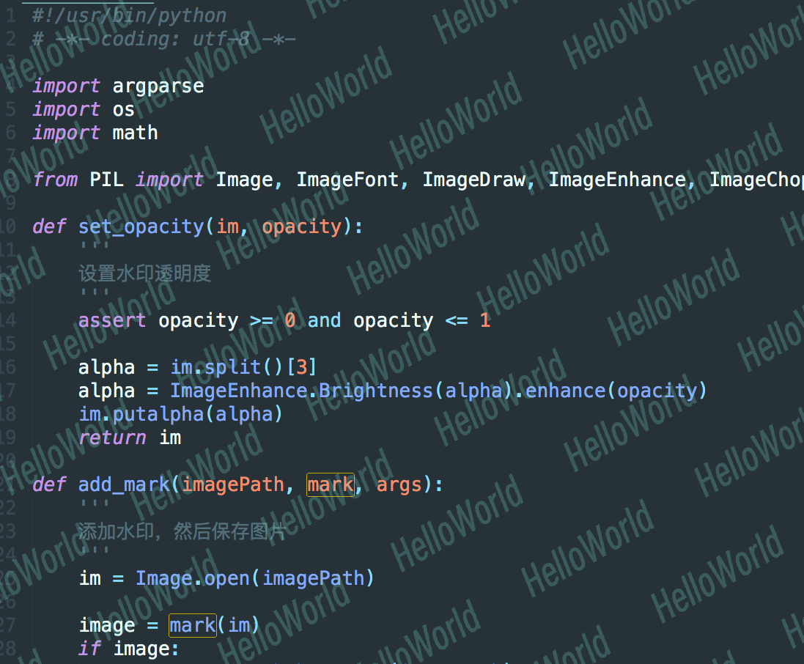

# 图形界面版 Run_marker.py

## usage

```powershell
pip install Pillow
pip install PySide6
```

## 效果

```powershell
python .\Run_marker.py
```



# 命令行版 marker.py

为图片添加文字水印
可设置文字**大小、颜色、旋转、间隔、透明度**

## 用法

需要 PIL 库

```powershell
pip install Pillow
```

可选参数：

|          |                                     |                                                                                                                                             |
| -------- | :---------------------------------- | ------------------------------------------------------------------------------------------------------------------------------------------- |
| -h       | --help                              | 显示帮助信息并退出                                                                                                                          |
| -f FILE  | --file FILE                         | 图像文件路径或目录                                                                                                                          |
| -m MARK  | --mark MARK                         | 水印内容                                                                                                                                    |
| -o OUT   | --out OUT                           | 图像输出目录，默认为 ./output                                                                                                               |
| -c COLOR | --color COLOR                       | 文本颜色，如 "#000000"，默认为 #00B294                                                                                                      |
| -s SPACE | --space SPACE                       | 水印之间的间距，默认为 75                                                                                                                   |
| -a ANGLE | --angle ANGLE                       | 水印的旋转角度，默认为 30                                                                                                                   |
|          | -font-family FONT_FAMILY            | 文本的字体家族，默认为`./font/SmileySans-Oblique.ttf`。在系统中使用字体时，只需输入字体文件名，例如 macOS 默认安装的 PingFang.ttc           |
|          | --font-height-crop FONT_HEIGHT_CROP | 更改水印字体高度裁剪，float 将解析为系数；int 将解析为值，默认为 "1.2"，即字体大小的 1.2 倍。这对中日韩字体很有用，因为行高可能高于字体大小 |
|          | --size SIZE                         | 字体大小，默认为 50                                                                                                                         |
|          | --opacity OPACITY                   | 水印不透明度，默认为 0.15                                                                                                                   |
|          | --quality QUALITY                   | 输出图像的质量，默认为 100                                                                                                                  |

```
usage: marker.py [-h] [-f FILE] [-m MARK] [-o OUT] [-c COLOR] [-s SPACE] [-a ANGLE] [--font-family FONT_FAMILY] [--font-height-crop FONT_HEIGHT_CROP] [--size SIZE]
                 [--opacity OPACITY] [--quality QUALITY]

optional arguments:
  -h, --help            show this help message and exit
  -f FILE, --file FILE  image file path or directory
  -m MARK, --mark MARK  watermark content
  -o OUT, --out OUT     image output directory, default is ./output
  -c COLOR, --color COLOR
                        text color like '#000000', default is #00B294
  -s SPACE, --space SPACE
                        space between watermarks, default is 75
  -a ANGLE, --angle ANGLE
                        rotate angle of watermarks, default is 30
  --font-family FONT_FAMILY
                        font family of text, default is './font/SmileySans-Oblique.ttf'
                        using font in system just by font file name
                        for example 'PingFang.ttc', which is default installed on macOS
  --font-height-crop FONT_HEIGHT_CROP
                        change watermark font height crop
                        float will be parsed to factor; int will be parsed to value
                        default is '1.2', meaning 1.2 times font size
                        this useful with CJK font, because line height may be higher than size
  --size SIZE           font size of text, default is 50
  --opacity OPACITY     opacity of watermarks, default is 0.15
  --quality QUALITY     quality of output images, default is 100
```

## 效果

```python
python .\marker.py -f .\input\test.png -m HelloWorld
```


